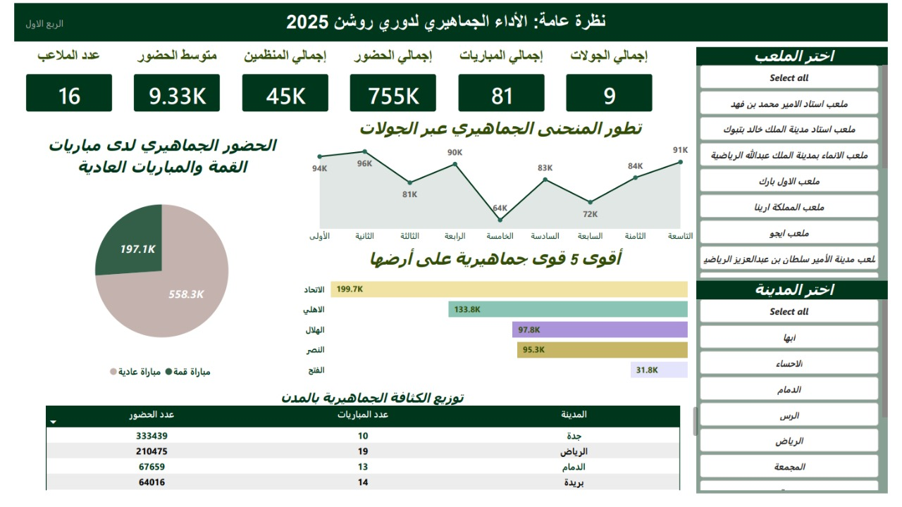
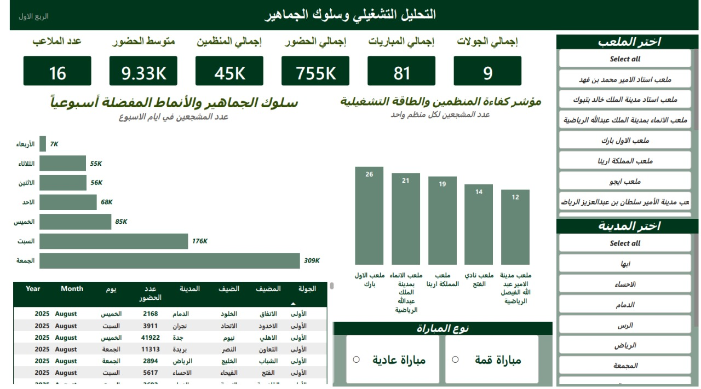
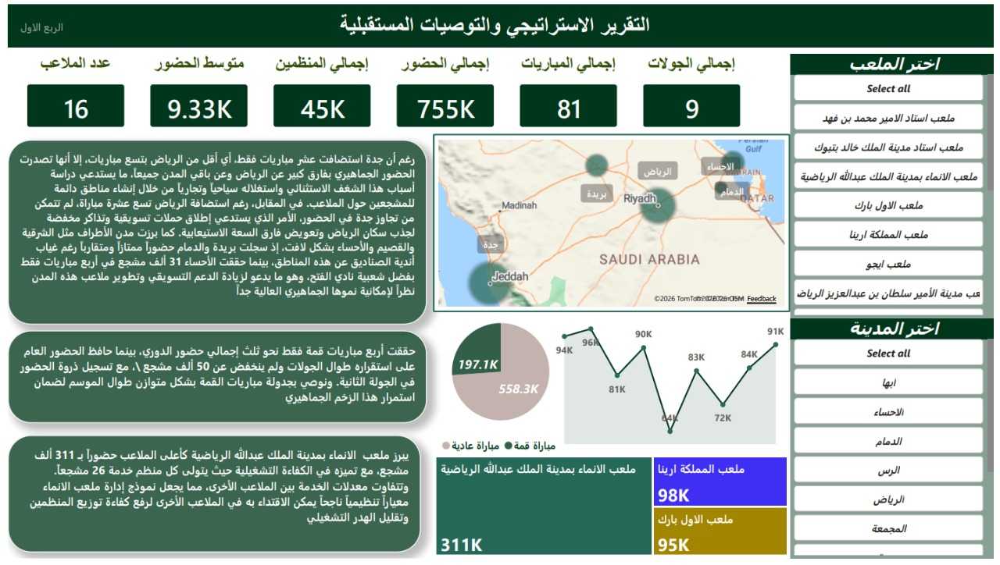

# 🇸🇦 Saudi Roshn League Fans Attendance & Operational Efficiency Dashboard (Q1 - 2025)

An interactive, end-to-end Power BI dashboard analyzing attendance patterns, geographic density, and operational organizer efficiency across 9 rounds (81 matches) of the Saudi Roshn League 2025.

---

## 📌 Dashboard Pages Overview

### 1. General Overview Dashboard (نظرة عامة: الأداء الجماهيري)
Analyzing total attendance, home/away splits, top teams, and geographic distribution across Saudi cities.


### 2. Operational & Fan Behavior Dashboard (التحليل التشغيلي وسلوك الجماهير)
Tracking weekday vs. weekend attendance trends and evaluating stadium organizer capacity ratios.


### 3. Strategic Report & Recommendations (التقرير الاستراتيجي والتوصيات)
Actionable insights on fan engagement, marketing strategies, and workforce optimization.


---

## 🛠️ Data Journey & Technical Challenges (Power Query & Modeling)

One of the most critical phases of this project was the **Data Engineering and Cleaning** process. The raw, dirty datasets presented significant logical and linguistic challenges that had to be addressed using **Power Query** before any visual design could begin:

### 1. The Linguistic & Consistency Clean-up
* **The Problem:** Stadium names and cities had multiple inconsistent spellings and typos (e.g., variation in Arabic letters like `ة` vs `ه`, and inconsistent naming of venues).
* **The Solution:** Applied conditional columns, text transformations, and standardized values in Power Query to ensure geographical filters worked flawlessly without scattering the data.

### 2. The Duplicate Attendance Trap (Home vs. Away)
* **The Problem:** The raw files contained nested lists representing Home and Away attendance. Standard techniques like naive `Unpivot` created duplicate rows which artificially doubled or tripled the actual physical attendance.
* **The Solution:** Implemented robust logical conditioning, index-based relationships, and custom DAX measures to aggregate the physical attendance accurately while preserving the home/away team split.

### 3. Calculating the Operational Staff Capacity
* **The Problem:** Evaluating workforce efficiency (Organizers) required combining separate transactional logs with match-day profiles.
* **The Solution:** Merged tables in Power Query based on unique Match IDs, and created a calculated field for **"Fans per Organizer"** ($$\text{Kpi} = \frac{\text{Total Attendance}}{\text{Total Organizers}}$$):
  $$Fans\ Per\ Organizer = \frac{Total\ Attendance}{Total\ Organizers}$$
  This allowed us to evaluate the actual workload per staff member across different stadiums.

---

## 📈 Key Insights & Strategic Recommendations

* **The Jeddah Phenomenon:** Despite Jeddah hosting fewer matches (10) compared to Riyadh (19), it recorded the highest total attendance (**333.4K** fans). This shows an extraordinary demand density. We recommend establishing permanent Fan Zones in Jeddah to maximize commercial revenue.
* **Weekend vs. Weekday Spikes:** Friday is the ultimate peak day (**309K** fans) followed by Saturday (**176K**). Organizing staffing should be scaled up dynamically for weekends, while weekdays should feature ticket-bundling promotions.
* **Operational Benchmark:** **Al-Inma Stadium** showed the highest efficiency index (1 organizer per 21 fans). This organizational model should be studied and benchmarked across other major venues like Al-Awwal Park and Kingdom Arena to optimize resource allocation.

---

## 📂 Project Structure

```text
├── 01_Raw_Data/              # Unprocessed Excel files (Attendance & Organizers)
├── 03_Power_BI_Models/       # The final .pbix Power BI file
├── 3pages/                   # High-res dashboard screenshots
├── تحليل_الأداء_الجماهيري.pptx  # PowerPoint presentation of the project
└── README.md                 # Project documentation (You are here)
